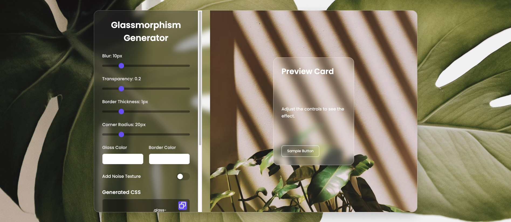

# Glassmorphism Generator ✨

A simple and interactive tool to generate **Glassmorphism CSS** effects with live preview. Perfect for modern UI designs, card layouts, buttons, and backgrounds.
---


---

## 🔹 Features

- Live preview of glassmorphic elements.
- Customizable parameters:
  - **Background blur**
  - **Opacity**
  - **Border radius**
  - **Shadow effects**
- Copy generated CSS with a single click.
- Responsive and lightweight design.
- Easy to integrate into any project.
---

## 💻 Demo

You can view the live demo here: [Glassmorphism Generator](https://sarangnayak.github.io/Glassmorphism-Generator/)

---

## ⚡ How to Use

1. Clone this repository:
   ```bash
   git clone https://github.com/sarangnayak/Glassmorphism-Generator.git
   ```
   	2.	Open index.html in your browser.
	3.	Adjust the sliders and inputs to customize your glassmorphic element.
	4.	Copy the generated CSS and use it in your project.

⸻

🛠️ Technologies Used
	•	HTML5
	•	CSS3
	•	JavaScript (Vanilla)
	•	Modern browser APIs for live preview

⸻

📁 Project Structure
```
Glassmorphism-Generator/
│
├─ index.html       # Main HTML file
├─ style.css        # Styling for the page
├─ script.js        # JavaScript for live preview & CSS generation
└─ README.md        # Project documentation

```
